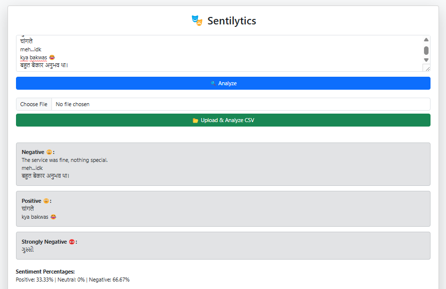
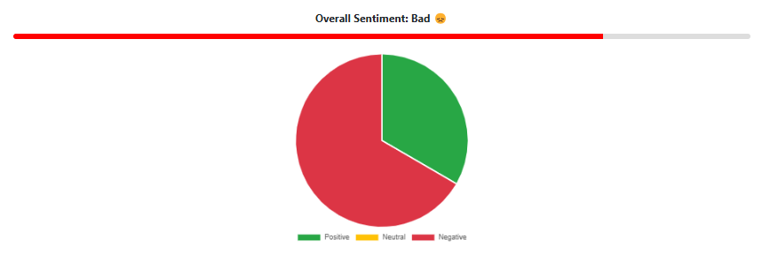

# Sentilytics – Where Text Meets Emotion 🎭

A hybrid sentiment analysis system that uses both rule-based (VADER) and deep-learning (BERT) NLP models to accurately determine the emotional tone of user input. It supports multilingual input, CSV bulk uploads, graphical sentiment breakdowns, and PDF exports.

## 🔍 Features

- 🌐 Multilingual Text Support with Auto-Translation
- 📊 Real-time Sentiment Analysis with Charts
- 📁 Bulk Sentiment Detection from CSV
- 🤖 Hybrid Sentiment Engine (VADER + BERT)
- 📄 Downloadable PDF Sentiment Report

## 🧠 Technologies Used

- **Backend**: Python, Flask, NLTK (VADER), HuggingFace Transformers
- **Frontend**: HTML, CSS, Bootstrap, JavaScript, Chart.js
- **Other Libraries**: Pandas, DeepTranslator, jsPDF, html2canvas

## 📂 Folder Structure

project/
├── app.py
├── templates/
│ └── index.html
├── static/
│ ├── script.js
│ └── style.css
├── uploads/
└── README.md

## 📌 Use Cases

- Analyzing customer reviews (e-commerce)
- Monitoring public opinion (politics, brands)
- Feedback analysis (education, events)
- Healthcare & therapy emotion tracking

